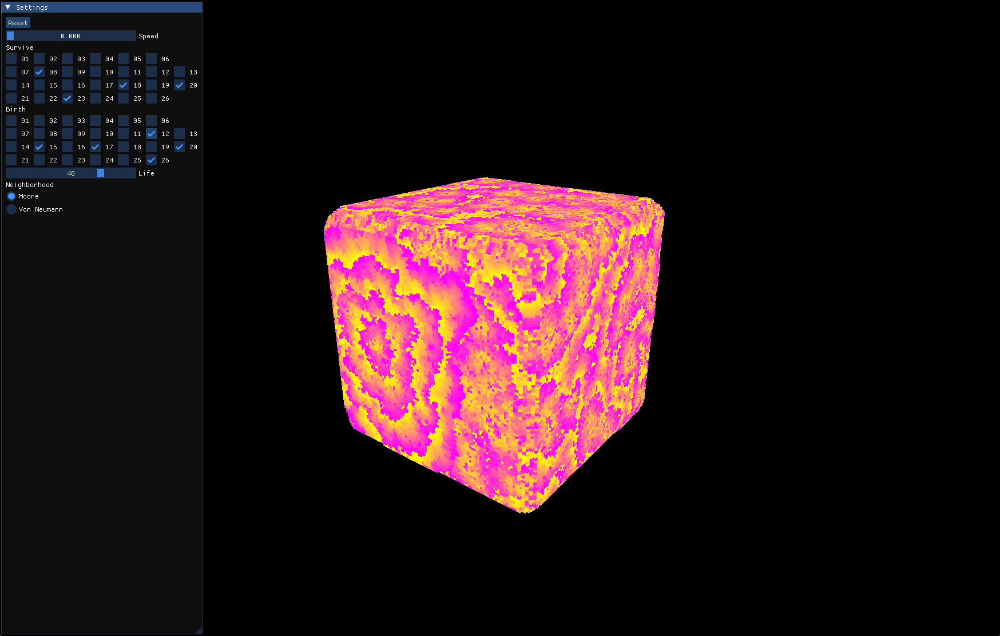

# 3D Cellular Automata



3D Cellular Automata using SDL3 GPU with compute shaders

### Building

#### Windows

Install the [Vulkan SDK](https://www.lunarg.com/vulkan-sdk/) for glslc

```bash
git clone https://github.com/jsoulier/3d_cellular_automata --recurse-submodules
cd 3d_cellular_automata
mkdir build
cd build
cmake ..
cmake --build . --parallel 8 --config Release
cd bin
./automata.exe
```

#### Linux

```bash
git clone https://github.com/jsoulier/3d_cellular_automata --recurse-submodules
cd 3d_cellular_automata
mkdir build
cd build
cmake .. -DCMAKE_BUILD_TYPE=Release
cmake --build . --parallel 8
cd bin
./automata
```

### References

- [Article](https://softologyblog.wordpress.com/2019/12/28/3d-cellular-automata-3/) by Softology
- [Youtube Video](https://www.youtube.com/watch?v=63qlEpO73C4) by Tantan